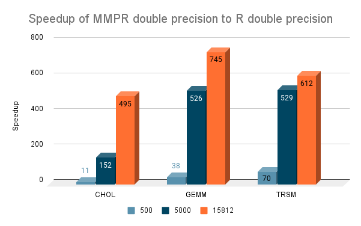
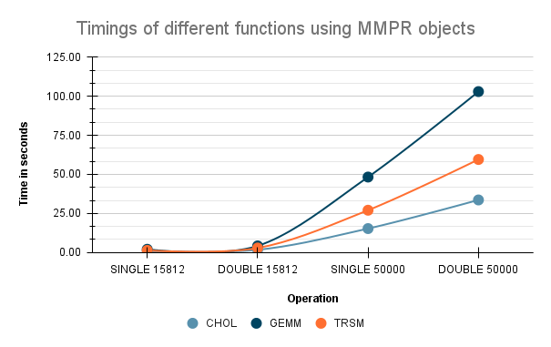

# MMPR

MMPR is an advanced package designed to provide R users with a customized data structure.
This package harnesses the combined strength of C++ and R, empowering users with high-performance computing capabilities.
Specifically tailored for researchers and data scientists working with multi or mixed-precision arithmetic,
MMPR serves as an invaluable tool for achieving efficient and accurate computations.

##### MMPR provides R users with two primary, tailor-made data structures:
- Normal matrix/vector with different precision allocation (16-bit (half-precision), 32-bit (single-precision), and 64-bit (double precision)).
- The Tile-Matrix layout is constructed based on the standard MMPR matrix, enabling the creation of a matrix with multiple tiles, each having a distinct precision.
___

## Requirements
- Rcpp (needs to be installed before trying to install the package), use `install.packages("Rcpp")` in R to install it.
- For optimal performance, `MKL` is recommended for building the package,
in case MKL is not found on the system, the package will automatically download [OpenBLAS](https://github.com/xianyi/OpenBLAS). Note: Prior to installation, it is essential to set the required environment variables..
- [Blaspp](https://github.com/icl-utk-edu/blaspp) (if not found, it will be installed automatically).
- [Lapackpp](https://github.com/icl-utk-edu/lapackpp) (if not found, it will be installed automatically).

___

## Installation
To install the package:
- Clone the MMPR package from [here](https://github.com/stsds/MMPR).
- Checkout to tag `v1.0.0` (Latest stable release).
- Run `R CMD INSTALL .` from the project root directory.
___


## Features
- Creation of matrix/vector with different precision allocation (16-bit (half-precision), 32-bit (single-precision), and 64-bit (double precision)).
- Support for all operators, basic utilities, binary operations, casters and converts, mathematical operations, and linear algebra.
- Tile-Matrix layout build-on normal MMPR matrix, offering the creation of a matrix with multiple tiles with a different precision for each one.
- Support for three main linear tile-algorithms `potrf, gemm, and trsm`.
- Support for converters to MMPR-Tile matrix

More details are available in the package [manual](vignettes/MMPR-manual.pdf)
___


## Testing
MMPR uses Catch2 library for C++ unit-testing, offering the ability to create an automated CI/CD pipeline for development.
All the modules contain a group of test cases to ensure the logical and mathematical validity of the added features.

To run the package tests:

```bash
./config.sh -t
./clean_build.sh
cd bin/
ctest -VV
```
___


## Example
```R
# creating MMPRTile matrix and performing tile-potrf

# creating an R matrix of double precision values
R_matrix <- matrix(c(1.21, 0.18, 0.13, 0.41, 0.06, 0.23,
              0.18, 0.64, 0.10, -0.16, 0.23, 0.07,
              0.13, 0.10, 0.36, -0.10, 0.03, 0.18,
              0.41, -0.16, -0.10, 1.05, -0.29, -0.08,
              0.06, 0.23, 0.03, -0.29, 1.71, -0.10,
              0.23, 0.07, 0.18, -0.08, -0.10, 0.36), 6, 6)

# creating a vector of strings, each string represents the precision of its corresponding tile.
# column major indexing is assumed
precision_metadata_vector <- c("single","double", "single", "single", "double", "double","single" , "single","double")

# MMPR Tile matrix initialization with size 6 x 6 and tile size 2 x 2
MMPRTile_mat <- new( MPRTile , 6, 6, 2, 2, R_matrix, precision_metadata_vector)

# Perform out of place tile cholesky decomposition
chol_matrix <- chol(MMPRTile_mat,overwrite_input = FALSE)
print(chol_matrix)
```

```R
# MMPR object creation
x <- new(MMPR, 50, "single")

# converting R object to MMPR object
y <- as.MMPR(1:24, precision = "single") # vector will be created

# converting R object to MMPR object
z <- as.MMPR(1:24, nrow = 4, ncol = 6, precision = "single") # Matrix will be created
```

More examples are available in [here](tests/R-tests)
___

## Benchmarking MMPR vs R

**This graph represents the speedup of MMPR single precision object to R double object in three major linear algebra functions.**


**This graph represents the speedup of MMPR double precision object to R double object in three major linear algebra functions.**




**This graph shows the timing of different functions with different sizes and precisions.**




#### Note:
The speedup of MMPR over R is because MMPR is using MKL blas instead of Rblas, offering parallel computation on the data.
Normally you can use MKL backend with normal R objects, however, switching blas backends on R is quite complex and needs a lot of modification on the environment itself,
 but in our case MMPR is using MKL without any modification to the environment itself, offering high speed computations with minimal efforts from the user side.